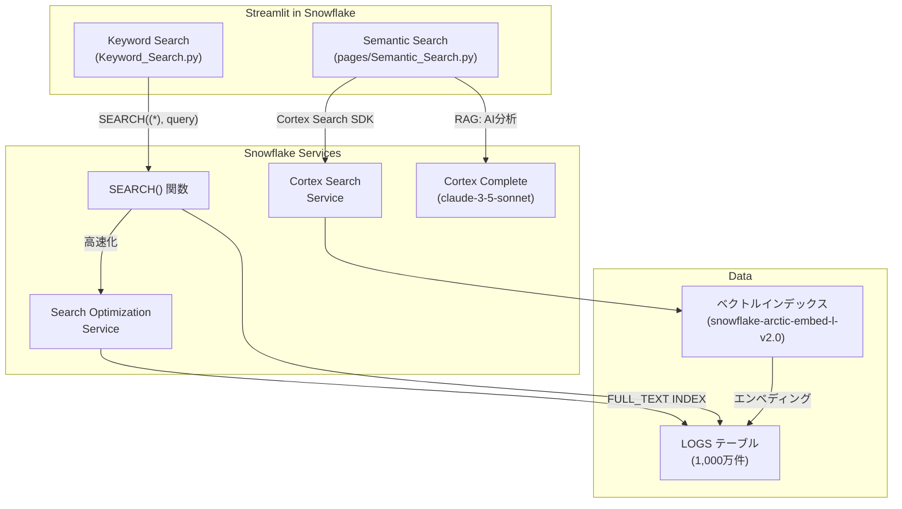
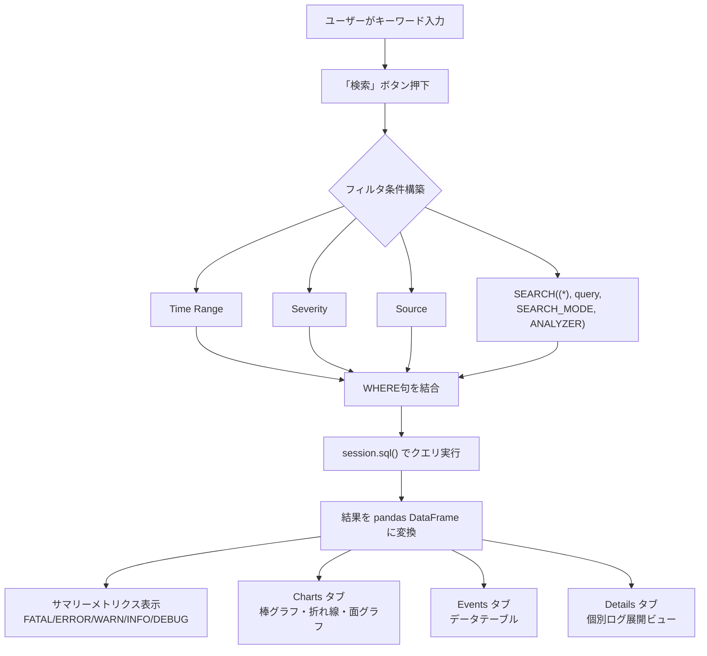
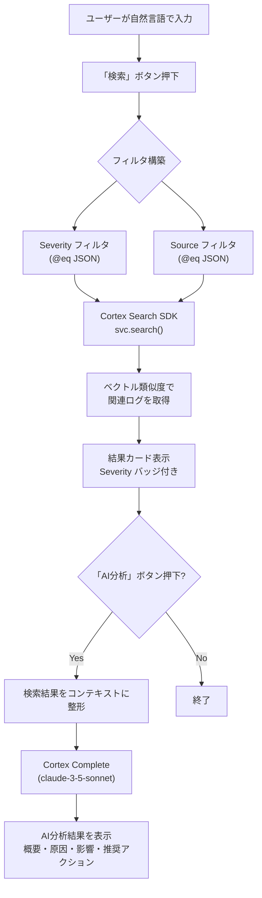
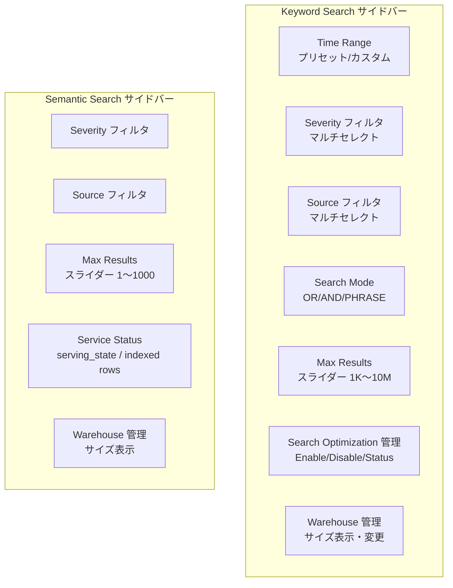

# Snowflake Log Search App

Snowflake の **SEARCH() 関数**、**Search Optimization Service**、**Cortex Search Service**、**Cortex Complete** を活用した、Splunk ライクなログ全文検索 & セマンティック検索アプリケーションです。

**Streamlit in Snowflake (SiS)** 上で動作します。

---

## 目次

1. [構築手順](#1-構築手順)
2. [アーキテクチャ・コードロジック](#2-アーキテクチャコードロジック)
3. [取扱説明書](#3-取扱説明書)
4. [注意点](#4-注意点)

---

## 1. 構築手順

### 1.1 前提条件

- Snowflake アカウント（`ACCOUNTADMIN` ロール推奨）
- Cortex Search / Cortex Complete が利用可能なリージョン
- Streamlit in Snowflake (SiS) が有効

### 1.2 データベース・スキーマ・Warehouse 作成

```sql
-- データベースとスキーマ
CREATE DATABASE IF NOT EXISTS LOG_SEARCH_APP;
USE DATABASE LOG_SEARCH_APP;
CREATE SCHEMA IF NOT EXISTS PUBLIC;

-- Warehouse（検索・インデックス用）
CREATE WAREHOUSE IF NOT EXISTS SEARCH_WH
    WAREHOUSE_SIZE = 'XSMALL'
    AUTO_SUSPEND = 60
    AUTO_RESUME = TRUE;

USE WAREHOUSE SEARCH_WH;
```

### 1.3 LOGS テーブル作成

```sql
CREATE OR REPLACE TABLE LOG_SEARCH_APP.PUBLIC.LOGS (
    LOG_ID      NUMBER AUTOINCREMENT START 1 INCREMENT 1,
    TIMESTAMP   TIMESTAMP_NTZ,
    SEVERITY    VARCHAR(10),
    SOURCE      VARCHAR(100),
    HOST        VARCHAR(100),
    MESSAGE     VARCHAR(16777216)
);
```

### 1.4 ダミーデータ生成（1,000万件）

大量のダミーログデータを `GENERATOR()` 関数で一括生成します。
Warehouse を一時的に大きくすると高速に生成できます。

```sql
-- Warehouse を一時的に拡大（任意）
ALTER WAREHOUSE SEARCH_WH SET WAREHOUSE_SIZE = 'XLARGE';

-- 1,000万件のダミーデータ挿入
INSERT INTO LOG_SEARCH_APP.PUBLIC.LOGS (TIMESTAMP, SEVERITY, SOURCE, HOST, MESSAGE)
SELECT
    DATEADD('second',
        -UNIFORM(0, 2592000, RANDOM()),  -- 過去30日間にランダム分散
        CURRENT_TIMESTAMP()
    ) AS TIMESTAMP,

    CASE UNIFORM(1, 100, RANDOM())
        WHEN  1 THEN 'FATAL'
        WHEN  2 THEN 'FATAL'
        WHEN  3 THEN 'ERROR'
        WHEN  4 THEN 'ERROR'
        WHEN  5 THEN 'ERROR'
        WHEN  6 THEN 'ERROR'
        WHEN  7 THEN 'ERROR'
        WHEN  8 THEN 'WARN'
        WHEN  9 THEN 'WARN'
        WHEN 10 THEN 'WARN'
        WHEN 11 THEN 'WARN'
        WHEN 12 THEN 'WARN'
        WHEN 13 THEN 'WARN'
        WHEN 14 THEN 'WARN'
        WHEN 15 THEN 'WARN'
        WHEN 16 THEN 'WARN'
        WHEN 17 THEN 'WARN'
        ELSE
            CASE WHEN UNIFORM(1, 100, RANDOM()) <= 60 THEN 'INFO'
                 ELSE 'DEBUG'
            END
    END AS SEVERITY,

    CASE UNIFORM(1, 8, RANDOM())
        WHEN 1 THEN 'api-gateway'
        WHEN 2 THEN 'auth-service'
        WHEN 3 THEN 'payment-service'
        WHEN 4 THEN 'user-service'
        WHEN 5 THEN 'notification-service'
        WHEN 6 THEN 'scheduler'
        WHEN 7 THEN 'data-pipeline'
        WHEN 8 THEN 'monitoring-agent'
    END AS SOURCE,

    'host-' || LPAD(UNIFORM(1, 50, RANDOM())::STRING, 3, '0') AS HOST,

    CASE UNIFORM(1, 20, RANDOM())
        WHEN  1 THEN 'Connection timeout after 30000ms to database server db-primary.internal:5432'
        WHEN  2 THEN 'OutOfMemoryError: Java heap space - allocated 2048MB, used 2047MB'
        WHEN  3 THEN 'HTTP 503 Service Unavailable - upstream server is temporarily unavailable'
        WHEN  4 THEN 'Authentication failed for user admin@example.com from IP 192.168.1.' || UNIFORM(1,255,RANDOM())::STRING
        WHEN  5 THEN 'Disk usage exceeded 90% threshold on volume /data - current usage: ' || UNIFORM(91,99,RANDOM())::STRING || '%'
        WHEN  6 THEN 'SSL certificate will expire in ' || UNIFORM(1,30,RANDOM())::STRING || ' days for domain api.example.com'
        WHEN  7 THEN 'Rate limit exceeded for API key ak_' || UNIFORM(1000,9999,RANDOM())::STRING || ' - 1000 requests per minute'
        WHEN  8 THEN 'Database replication lag detected: ' || UNIFORM(5,120,RANDOM())::STRING || ' seconds behind primary'
        WHEN  9 THEN 'Request processed successfully in ' || UNIFORM(1,500,RANDOM())::STRING || 'ms - endpoint: /api/v2/users'
        WHEN 10 THEN 'Cache hit ratio dropped to ' || UNIFORM(10,50,RANDOM())::STRING || '% - consider increasing cache size'
        WHEN 11 THEN 'Scheduled job batch_export completed - processed ' || UNIFORM(1000,50000,RANDOM())::STRING || ' records'
        WHEN 12 THEN 'New deployment v2.' || UNIFORM(1,99,RANDOM())::STRING || '.' || UNIFORM(0,99,RANDOM())::STRING || ' rolled out to production cluster'
        WHEN 13 THEN 'Connection pool exhausted - max connections: 100, active: 100, waiting: ' || UNIFORM(1,50,RANDOM())::STRING
        WHEN 14 THEN 'DNS resolution failed for service discovery endpoint consul.internal:8500'
        WHEN 15 THEN 'Garbage collection pause: ' || UNIFORM(100,5000,RANDOM())::STRING || 'ms - heap before: 4GB, heap after: 1.2GB'
        WHEN 16 THEN 'Message queue consumer lag: ' || UNIFORM(1000,100000,RANDOM())::STRING || ' messages behind in topic orders-events'
        WHEN 17 THEN 'Health check passed - all ' || UNIFORM(5,20,RANDOM())::STRING || ' downstream dependencies responsive'
        WHEN 18 THEN 'Retry attempt ' || UNIFORM(1,5,RANDOM())::STRING || '/5 for payment transaction tx_' || UNIFORM(100000,999999,RANDOM())::STRING
        WHEN 19 THEN 'Configuration reloaded from etcd - ' || UNIFORM(1,20,RANDOM())::STRING || ' keys updated'
        WHEN 20 THEN 'User session expired for session_id=' || UNIFORM(100000,999999,RANDOM())::STRING || ' after 3600s inactivity'
    END AS MESSAGE

FROM TABLE(GENERATOR(ROWCOUNT => 10000000));

-- Warehouse を元に戻す
ALTER WAREHOUSE SEARCH_WH SET WAREHOUSE_SIZE = 'XSMALL';
```

### 1.5 Search Optimization Service 有効化

キーワード検索を高速化するため、`MESSAGE` カラムに全文検索インデックスを作成します。

```sql
ALTER TABLE LOG_SEARCH_APP.PUBLIC.LOGS
    ADD SEARCH OPTIMIZATION
    ON FULL_TEXT(MESSAGE, ANALYZER => 'UNICODE_ANALYZER');
```

> インデックス構築はバックグラウンドで実行されます。`DESCRIBE SEARCH OPTIMIZATION ON LOG_SEARCH_APP.PUBLIC.LOGS` で進捗を確認できます。

### 1.6 CHANGE_TRACKING 有効化

Cortex Search Service の増分更新に必要です。

```sql
ALTER TABLE LOG_SEARCH_APP.PUBLIC.LOGS SET CHANGE_TRACKING = TRUE;
```

### 1.7 Cortex Search Service 作成

セマンティック検索用の Cortex Search Service を作成します。
`LOG_ID` は NUMBER 型のため、VARCHAR にキャストして PRIMARY KEY に指定します。

```sql
-- Warehouse を一時的に拡大（ベクトル化を高速化）
ALTER WAREHOUSE SEARCH_WH SET WAREHOUSE_SIZE = 'X4LARGE';

-- Cortex Search Service 作成
CREATE OR REPLACE CORTEX SEARCH SERVICE LOG_SEARCH_APP.PUBLIC.LOG_SEMANTIC_SEARCH
    ON MESSAGE
    PRIMARY KEY (LOG_ID)
    ATTRIBUTES SEVERITY, SOURCE, HOST
    WAREHOUSE = SEARCH_WH
    TARGET_LAG = '7 days'
    EMBEDDING_MODEL = 'snowflake-arctic-embed-l-v2.0'
    AS (
        SELECT LOG_ID::VARCHAR AS LOG_ID, TIMESTAMP, SEVERITY, SOURCE, HOST, MESSAGE
        FROM LOG_SEARCH_APP.PUBLIC.LOGS
    );

-- ベクトル化の進捗確認（serving_state が ACTIVE になるまで待つ）
SHOW CORTEX SEARCH SERVICES IN SCHEMA LOG_SEARCH_APP.PUBLIC;

-- ベクトル化完了後、Warehouse を縮小
ALTER WAREHOUSE SEARCH_WH SET WAREHOUSE_SIZE = 'XSMALL';
```

> **注意**: 1,000万件のベクトル化には数十分〜数時間かかる場合があります。`serving_state` が `ACTIVE`、`source_data_num_rows` が `10,000,000` になれば完了です。

### 1.8 Streamlit in Snowflake アプリのデプロイ

```sql
-- ステージ作成
CREATE STAGE IF NOT EXISTS LOG_SEARCH_APP.PUBLIC.STREAMLIT_STAGE
    DIRECTORY = (ENABLE = TRUE);
```

ローカルからファイルをアップロード:

```sql
-- メインファイル
PUT 'file:///path/to/Keyword_Search.py'
    @LOG_SEARCH_APP.PUBLIC.STREAMLIT_STAGE/log_search/
    OVERWRITE=TRUE AUTO_COMPRESS=FALSE;

-- セマンティック検索ページ
PUT 'file:///path/to/pages/Semantic_Search.py'
    @LOG_SEARCH_APP.PUBLIC.STREAMLIT_STAGE/log_search/pages/
    OVERWRITE=TRUE AUTO_COMPRESS=FALSE;

-- 依存関係ファイル
PUT 'file:///path/to/environment.yml'
    @LOG_SEARCH_APP.PUBLIC.STREAMLIT_STAGE/log_search/
    OVERWRITE=TRUE AUTO_COMPRESS=FALSE;
```

Streamlit アプリ作成:

```sql
CREATE STREAMLIT IF NOT EXISTS LOG_SEARCH_APP.PUBLIC.LOG_SEARCH
    ROOT_LOCATION = '@LOG_SEARCH_APP.PUBLIC.STREAMLIT_STAGE/log_search'
    MAIN_FILE = 'Keyword_Search.py'
    QUERY_WAREHOUSE = 'SEARCH_WH';
```

> サイドバーに「Keyword Search」「Semantic Search」の2ページが表示されます。

---

## 2. アーキテクチャ・コードロジック

### 2.1 全体アーキテクチャ



### 2.2 Keyword Search フロー



### 2.3 Semantic Search + RAG フロー



### 2.4 サイドバー機能



### 2.5 ファイル構成

```
snowflake-log-search-app/
├── Keyword_Search.py          # メインページ（キーワード検索）
│   ├── Custom CSS             # 幅広レイアウト、バッジ、カード
│   ├── Sidebar Filters        # 時間・重要度・ソース・モード
│   ├── Search Optimization    # 有効化/無効化/ステータス
│   ├── Warehouse Management   # サイズ表示・変更
│   ├── Search Execution       # SEARCH()関数でクエリ実行
│   ├── Charts/Events/Details  # 結果表示タブ
│   └── Help                   # 使い方・技術情報
│
├── pages/
│   └── Semantic_Search.py     # セマンティック検索ページ
│       ├── Custom CSS         # 紫グラデーションテーマ
│       ├── Sidebar Filters    # 重要度・ソース
│       ├── Service Status     # Cortex Search状態
│       ├── Warehouse Display  # サイズ表示
│       ├── Cortex Search      # セマンティック検索実行
│       ├── RAG (AI Analysis)  # Cortex Complete で分析
│       └── Help               # セマンティック検索の説明
│
└── environment.yml            # SiS依存関係（snowflake パッケージ）
```

---

## 3. 取扱説明書

### 3.1 Keyword Search（キーワード検索）

#### 検索の実行

1. 検索バーにキーワードを入力（例: `timeout error`, `OutOfMemory`, `503`）
2. **「検索」ボタン**を押して検索を実行
3. キーワードなしで検索すると、フィルタ条件のみで絞り込みます

#### 検索モード

| モード | 説明 | 例 |
|---|---|---|
| **OR**（デフォルト） | いずれかのキーワードを含む | `timeout error` → "timeout" または "error" を含むログ |
| **AND** | すべてのキーワードを含む | `timeout database` → 両方を含むログのみ |
| **PHRASE** | 完全フレーズ一致 | `Connection timeout` → この語順で連続する箇所のみ |

#### フィルタ

- **Time Range** — プリセット（1時間〜30日）またはカスタム日付範囲
- **Severity** — FATAL / ERROR / WARN / INFO / DEBUG を選択
- **Source** — アプリケーション・サービスを選択
- **Max Results** — 最大取得件数（1,000〜10,000,000件、1,000刻み）

#### 結果表示

- **サマリーメトリクス** — 重要度別の件数をバッジ付きで表示
- **Charts タブ** — タイムライン棒グラフ、イベント推移折れ線、重要度分布面グラフ、Top Sources、Events by Host
- **Events タブ** — 全結果のデータテーブル（ソート可能）
- **Details タブ** — 個別ログの展開ビュー（メッセージ全文・メタデータ）

#### 元データを確認

- 検索バーの下にある「元データを確認」を展開すると、LOGSテーブルの最新データをプレビューできます
- 表示件数は数値入力で変更可能（デフォルト100件、最大10,000件）

#### Search Optimization 管理（サイドバー）

- **Status: Configured** — インデックスが有効。対象カラム（`FULL_TEXT UNICODE_ANALYZER on MESSAGE`）が表示されます
- **Check Index Status** — インデックスの構築状態を確認（READY / BUILDING）
- **Disable** — Search Optimization を無効化
- **Enable** — MESSAGE カラムに FULL_TEXT インデックスを作成

#### Warehouse 管理（サイドバー）

- 現在の Warehouse 名とサイズが表示されます
- ドロップダウンでサイズを選択し「Apply Warehouse Size」で変更可能

---

### 3.2 Semantic Search（セマンティック検索）

#### セマンティック検索とは

キーワードの完全一致ではなく、**AI（埋め込みベクトル）を使って意味的に類似したログ**を検索します。

| | キーワード検索 | セマンティック検索 |
|---|---|---|
| **検索方式** | トークン一致 | AI埋め込みベクトルによる意味検索 |
| **入力** | キーワード（例: `timeout error`） | 自然言語（例: `接続が切れてサービスが応答しない`） |
| **強み** | 高速・正確なキーワードマッチ | 表現が異なっても意味が近いログを発見 |
| **ユースケース** | 既知のエラーを検索 | 未知の問題の類似事象を調査 |

#### 検索の実行

1. 検索バーに自然言語で状況を記述（例: `メモリ不足でサービスが停止した`）
2. **「検索」ボタン**を押して検索を実行
3. 結果はAIが意味的に関連度が高いと判断した順に表示されます

#### AI分析（RAG）機能

検索結果が表示された後:

1. **「AI分析（まとめ・考察を生成）」ボタン**を押す
2. セマンティック検索で抽出されたログが **Cortex Complete (claude-3-5-sonnet)** に送信されます
3. 以下の観点で自動分析結果が表示されます:
   - **概要** — ログ全体の傾向
   - **根本原因の推定** — 問題の原因分析
   - **影響範囲** — ホスト・サービス・重要度の分布
   - **推奨アクション** — 具体的な対応策
   - **注意点** — 追加調査が必要な項目

#### Service Status（サイドバー）

- **Serving: ACTIVE** — サービスが稼働中で検索可能
- **Serving: INITIALIZING** — ベクトル化処理中（検索不可）
- **Indexed rows** — インデックス済みの行数

---

## 4. 注意点

### 4.1 Streamlit in Snowflake (SiS) の制限

SiS の Streamlit バージョンは OSS 版より古く、以下の機能が**使用できません**:

| 使用不可の機能 | 代替手段 |
|---|---|
| `st.navigation` / `st.Page` | `pages/` ディレクトリ + ファイル名規約 |
| `st.set_page_config(layout="wide")` | CSS で `.block-container { max-width: 95% }` |
| `st.column_config` | 通常の `st.dataframe` |
| `st.badge` / `st.space` | CSS + `st.markdown(unsafe_allow_html=True)` |
| Material Icons | テキストのみ |
| `st.bar_chart(color=...)` | デフォルトカラーのみ |

### 4.2 SiS のカラム名ダブルクォート問題

SiS 環境の `session.sql("SHOW ...").to_pandas()` は、カラム名が**ダブルクォートで囲まれた状態**で返されます。

```python
# NG（SiS環境で N/A になる）
wh_info["size"].iloc[0]

# OK（SiS環境対応）
if '"size"' in wh_info.columns:
    wh_info['"size"'].iloc[0]
elif 'size' in wh_info.columns:
    wh_info['size'].iloc[0]
```

`SHOW WAREHOUSES`, `SHOW CORTEX SEARCH SERVICES`, `DESCRIBE SEARCH OPTIMIZATION` 等のメタデータクエリすべてに影響します。

### 4.3 Cortex Search Service

- **EMBEDDING_MODEL は作成後に変更不可** — モデルを変更するには `CREATE OR REPLACE` で再作成が必要
- **PRIMARY KEY は VARCHAR 型のみ** — NUMBER 型カラムは `LOG_ID::VARCHAR AS LOG_ID` のようにキャストが必要
- **TARGET_LAG** — 最大 `7 days`。値を大きくするとリフレッシュ頻度が下がりコスト削減
- **ベクトル化時間** — 1,000万件で数十分〜数時間。Warehouse を一時的に拡大すると高速化
- **refresh_mode: INCREMENTAL** — PRIMARY KEY を設定すると増分更新（変更行のみ再ベクトル化）

### 4.4 Snowpark の注意点

- `session.sql()` のバインド変数は**位置パラメータ（`?`）をリストで渡す**必要があります（名前付きバインド不可）

```python
# OK
session.sql("SELECT * FROM T WHERE COL = ?", params=["value"])

# NG
session.sql("SELECT * FROM T WHERE COL = :val", params={"val": "value"})
```

### 4.5 コストに関する注意

| サービス | コスト要因 |
|---|---|
| **Search Optimization Service** | テーブルサイズに応じたストレージ・メンテナンスコスト |
| **Cortex Search Service** | ベクトル化（初回 + 増分更新）の Warehouse コンピュートコスト |
| **Cortex Complete** | トークン数に基づく従量課金（RAG分析時） |
| **Warehouse** | 検索クエリ実行時のコンピュートコスト |

不要時は以下で停止・削除できます:

```sql
-- Search Optimization を無効化
ALTER TABLE LOG_SEARCH_APP.PUBLIC.LOGS DROP SEARCH OPTIMIZATION;

-- Cortex Search Service を削除
DROP CORTEX SEARCH SERVICE LOG_SEARCH_APP.PUBLIC.LOG_SEMANTIC_SEARCH;

-- Warehouse をサスペンド
ALTER WAREHOUSE SEARCH_WH SUSPEND;
```

### 4.6 environment.yml

SiS の依存関係ファイルは Anaconda 形式です。パッケージ名は小文字で、`>=` バージョン指定構文は使えません。

```yaml
name: sf_env
channels:
  - snowflake
dependencies:
  - snowflake
```

### 4.7 マルチページの制御

- SiS では `pages/` ディレクトリ内のファイル名がサイドバーのページ名になります
- メインファイル名もサイドバーに表示されるため、`Keyword_Search.py` のように命名します
- `ALTER STREAMLIT ... SET MAIN_FILE = 'Keyword_Search.py'` でエントリポイントを変更可能

---

## 技術スタック

| コンポーネント | 技術 |
|---|---|
| UI | Streamlit in Snowflake |
| キーワード検索 | `SEARCH()` 関数 + Search Optimization Service |
| セマンティック検索 | Cortex Search Service (`snowflake-arctic-embed-l-v2.0`) |
| AI分析 (RAG) | Cortex Complete (`claude-3-5-sonnet`) |
| データ | Snowflake テーブル (1,000万件ログデータ) |
| 言語 | Python (Snowpark) |
